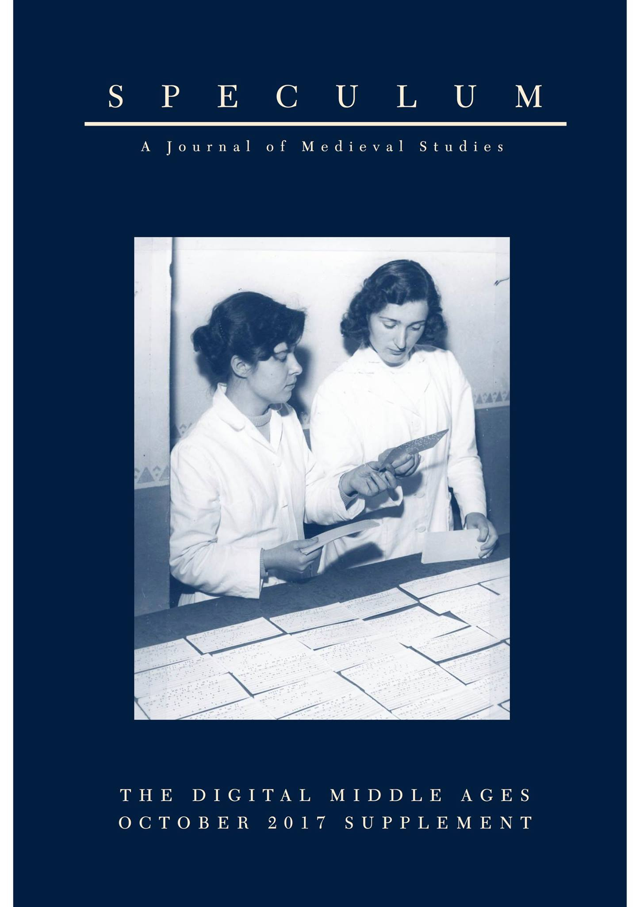

<section id="table-of-contents" class="toc">
  <header>
    <h3>Overview</h3>
  </header>

*  Auto generated table of contents
{:toc}

</section><!-- /#table-of-contents -->

### Digital Supplement *Speculum* online!

- *Speculum. A Journal of Medieval Studies* 92:S1 (2017), digital supplement: 'The Digital Middle Ages', guest edited by David J. Birnbaum, Sheila Bonde, Mike Kestemont. CC-BY-NC [[link]](http://www.journals.uchicago.edu/toc/spc/2017/92/S1). Including:
- David J. Birnbaum, Sheila Bonde, Mike Kestemont, "The Digital Middle Ages: An Introduction", pp. S1–S38 [[pdf]](http://www.journals.uchicago.edu/doi/pdfplus/10.1086/694236).
- Mike Kestemont, Vincent Christlein, Dominique Stutzmann, "Artificial Paleography: Computational Approaches to Identifying Script Types in Medieval Manuscripts", pp. S86–S109.
- David J. Birnbaum, Sheila Bonde, Mike Kestemont, "The Digital Middle Ages: A *Speculum* Supplement", pp. 961–962.

### Recent
- Kestemont, M. & Karsdorp, F., 'Het Atlantis van de Middelnederlandse ridderepiek. Een schatting van het tekstverlies met methodes uit de ecodiversiteit', *Spiegel der Letteren* 61 (3), 271-290. DOI:10.2143/SDL.61.3.3287540.
- Karsdorp, F., Manjavacas, E. & Kestemont, M. "Keepin’ it real: Linguistic models of authenticity judgments for artificially generated rap lyrics." *PLoS ONE* 14:10 (2019), e0224152 [doi.org/10.1371/journal.pone.0224152] [[link]](https://journals.plos.org/plosone/article?id=10.1371/journal.pone.0224152).
- Manjavacas, E.; Kestemont, M. & Karsdorp, F., "Generation of Hip-Hop Lyrics with Hierarchical Modeling and Conditional Templates", *Proceedings of the 12th International Conference on Natural Language Generation* (ACL, 2019) pp. 301-310 [[pdf]](https://www.aclweb.org/anthology/W19-8638).
- Haverals, W., Karsdorp, F. & Kestemont, M., "Rekenen op ritme. Een datagedreven oplossing voor het automatisch scanderen van de historische lyriek in de DBNL", *Vooys* 37:3 (2019), pp. 6-17.
- Haverals, W., Karsdorp, F. & Kestemont, M. "Data-Driven Syllabification for Middle Dutch." *Digital Medievalist* 12:1 (2019), pp. 1–23 [https://doi.org/10.16995/dm.83] [[link]](https://journal.digitalmedievalist.org/articles/10.16995/dm.83/).

### In press
* Eder, M., Rybicki, J. and Kestemont, M. Measuring Style. Forthcoming in *Digital Humanities for Literary Studies: Theories, Methods, and Practices*, ed. by J. O'Sullivan, UPenn Press (2016).
* Karsdorp, F.; Kestemont, M. & Riddell, A. *Humanities Data Analysis. Case Studies with Python*. Princeton University Press, [2021].

## Journal papers

### 2019
- Mike  Kestemont, Gunther Martens & Thorsten Ries, ‘A Computational Approach to Authorship Verification of Johann Wolfgang Goethe’s Contributions to the  *Frankfurter  gelehrte  Anzeigen*  (1772–73)’,  *Journal  of  European  Periodical Studies*, 4.1 (2019), 115–43 [[link]](https://ojs.ugent.be/jeps/article/view/10188/11234).
- Mike Kestemont & Luc Herman, 'Can Machines Read (Literature)?'. *Umanistica Digitale* 5 (2019), DOI: 10.6092/issn.2532-8816/8511. CC-BY license. [[link]](https://umanisticadigitale.unibo.it/article/view/8511).
- Mike Kestemont & Dirk van Hulle, 'Theorie en de digitale geesteswetenschappen? Ten geleide', *Tijdschrift voor Nederlandse taal- en letterkunde* 135:4  (2019), p. 301-302.
- Mike Kestemont & Luc Herman, 'Kunnen machines (literatuur) lezen?', *Tijdschrift voor Nederlandse taal- en letterkunde* 135:4  (2019), p. 316-328.

### 2018
* Kestemont, M., ‘Stylometric Authorship Attribution for the Middle Dutch Mystical Tradition from Groenendaal’, *Dutch Crossing. Journal of Low Countries Studies* 42:3 (2018), pp. 203-237 [doi:10.1080/03096564.2016.1252077].
* Mike Kestemont, "Aan de taal kent men de hand. Talige kopiistherkenning en de scribenten van de Lancelotcompilatie". *Spiegel der Letteren* 60:3-4 (2018), 157-188. DOI: 10.2143/SDL.60.3.3285821.
* Franzini Greta, Kestemont Mike, Rotari Gabriela, Jander Melina, Ochab Jeremi K., Franzini Emily, Byszuk Joanna, & Rybicki Jan. "Attributing authorship in the noisy digitized correspondence of Jacob and Wilhelm Grimm". *Frontiers in Digital Humanities* 5:4(2018), p. 1-15 [[paper]](https://www.frontiersin.org/articles/10.3389/fdigh.2018.00004/full).
* Tanghe, Koen & Kestemont, Mike, "Edinburgh and the Birth of British Evolutionism: A Peek behind a Veil of Anonymity", *BioScience*, Advance access published Published: 20 June 2018. DOI: 10.1093/biosci/biy049 [[link]](https://academic.oup.com/bioscience/advance-article-abstract/doi/10.1093/biosci/biy049/5039568?redirectedFrom=fulltext).

### 2017
* Kestemont, M., De Pauw, G., Van Nie, R. & Daelemans, W., 'Lemmatisation for Variation-Rich Languages Using Deep Learning'. *DSH -- Digital Scholarship in the Humanities* 32:4 (2017), 797-815. DOI: https://doi.org/10.1093/llc/fqw034
* Kestemont, M. & J. de Gussem, 'Integrated Sequence Tagging for Medieval Latin Using Deep Representation Learning', *Journal of Data Mining & Digital Humanities* (2017), pp. 17 [[pdf](https://jdmdh.episciences.org/3835/pdf)]. Special Issue on Computer-Aided Processing of Intertextuality in Ancient Languages, ed. M. Buechler and L. Mellerin.
* Stover, J.A. & Kestemont, M., 'Reassessing the Apuleian Corpus: A Computational Approach to Authenticity', *The Classical Quarterly* 66:2 (2017), 645–672. [[doi]](doi:10.1017/S0009838816000768).

### 2016
* Kestemont, M., Stover, J., Koppel, M., Karsdorp, K. & Daelemans, W., 'Authenticating the writings of Julius Caesar'. In: *Expert Systems with Applications* 63 (2016): pp. 86--96 [[link]](http://www.sciencedirect.com/science/article/pii/S0957417416303116).
* Kestemont, M., 'Computers leren taal uit het niets', *Onze Taal. Tijdschrift over taal, tekst en communicatie* 55:1 (2016), pp. 9-11.
* Kestemont, M., 'Beta humanities. De opmars van digitale technieken in de geesteswetenschappen'. *Neerlandia. Nederlands-Vlaams tijdschrift voor taal, cultuur en maatschappij* 120:3 (2016), pp. 4-7.
* Stover, J.; Winter, Y.; Koppel, M. & Kestemont, M. 'Computational Authorship Verification Method Attributes New Work to Major 2nd Century African Author'. In: *Journal of the American Society for Information Science and Technology* 67:1 (2016), pp. 239--242. [[link]](http://onlinelibrary.wiley.com/doi/10.1002/asi.23460/abstract).
* D. van Hulle & M. Kestemont, 'Periodizing Samuel Becket's Works: A Stylochronometric Approach', *Style* 60:2 (2016), 172-202.
* Stover, J. & Kestemont, M., 'The Authorship of the *Historia Augusta*: Two new computational studies'. In: *Bulletin of the Institute of Classical Studies* 59:2 (2016), pp. 140--157 [Digital Classics themed issue]. DOI: 10.1111/j.2041-5370.2016.12043.x
* Eder, M.; Rybicki, J. & Kestemont, M., 'Stylometry with R: A Package for Computational Text Analysis'. *The R Journal* 8:1 (2016, pp. 107--121) [[pdf]](https://journal.r-project.org/archive/2016-1/eder-rybicki-kestemont.pdf)

### 2015
* Kestemont, M.; Moens, S. & Deploige, J., 'Collaborative Authorship in the Twelfth Century. A Stylometric Study of Hildegard of Bingen and Guibert of Gembloux'. *Digital Scholarship in the Humanities* 30:2 (2015), pp. 199--224, [[doi]](http://dx.doi.org/10.1093/llc/fqt063).
* Kestemont, M., 'A Computational Analysis of the Scribal Profiles in Two of the Oldest Manuscripts of Hadewijch’s *Letters*', *Scriptorium* 69 (2015), 159-177.

### 2014
* Rybicki, J.; Hoover, D. & Kestemont, M. (2014). 'Collaborative authorship: Conrad, Ford and Rolling Delta’. *LLC: The Journal of Digital Scholarship in the Humanities* 29:3, pp. 422-431.
* Kestemont, M. 'A Shallow Reading of the Limburg Sermons'. *Ons Geestelijk Erf* (2014) 85:3, pp. 145-162. DOI: 10.2143/OGE.85.3.3062090. ISSN : 0774-2827; E-ISSN : 1783-1652.
* Kestemont, M. 'Serendipiteit en macro-medioneerlandistiek'. *Madoc. Tijdschrift over de Middeleeuwen* (2014) 28:3, pp. 157-165.

### 2013
* Kestemont, M. (2013). 'Produits de terroir? La littérature régionale dans la Flandre impériale et le cas de la chanson de geste moyen-néerlandaise'. *Publications du Centre Européen d'Etudes Bourguignonnes* 54, pp. 37-55.
* De Bruijn, E. & Kestemont, M., 'Contrastive Multivariate Analyses of the Middle Low German Flos unde Blankeflos Tradition', in: *Neuphilologische Mitteilungen. Bulletin of the Modern Language Society* 114:2 (2013), pp. 171-205.
* Hogenbirk, M. & Kestemont, M., 'Het werk van een klerk. Een stylometrische verkenning van het auteurschap achter *Der ystorien bloeme*' [The Work of a Clerk. A Stylometric Exploration of the Authorship behind 'The Flower of History'], *Tijdschrift voor Nederlandse Taal- en Letterkunde* 129:4 (2013), 246-273.
* Kestemont, M., 'Arthur's Authors. A Quantitative Study of the Rhyme Words in the Middle Dutch Arthurian Epic', in: *Zeitschrift für deutsches Altertum und deutsche Literatur* 142:1 (2013), pp. 1-33.

### 2012
* Kestemont, M., Daelemans, W. & Sandra, D., 'Robust Rhymes? The Stability of Authorial Style in Medieval Narratives', in *Journal of Quantitative Linguistics* 19:1 (2012), 54-76.
* Kestemont, M., 'Auteursherkenning met rijmwoorden in de Middelnederlandse Artur- en Karelepiek. Eerherstel voor Icarus?'' [Authorship attribution using rhyme words in the Middle Dutch Arthurian and Carolingian epic. Icarus's rehabilitation?], *Tijdschrift voor Nederlandse Taal- en Letterkunde* 128:2 (2012), 135-160.
* Kestemont, M., 'Keizerlijk Vlaanderen. Streekliteratuur in Rijks-Vlaanderen en de casus van de Karelepiek' [Imperial Flanders. Regional Literature in la Flandre impériale and the case of the chanson de geste], *Queeste. Journal of Medieval Literature in the Low Countries* 19:2 (2012), 91-111.
* Kestemont, M., 'Stylometry for Medieval Authorship Studies: An Application to Rhyme Words?, *Digital Philology. A Journal of Medieval Cultures* 1:1 (2012), 42-72.
* Kestemont, M.; Luyckx, K.; Daelemans, W. & Crombez, T., 'Cross-Genre Authorship Verification Using Unmasking', *English Studies. A journal of English language and literature* 93:3 (2012), 348-364 [special issue about authorship attribution (eds. J.C. Martin & A. Miranda)].

### 2011
* Kestemont, M., 'What can Stylometry Learn from its Application to Middle Dutch Literature?', in: *Journal of Dutch Literature* 2:2 (2011), 46-65.
* Kestemont, M. 'De meesters van de Spiegel. Auteursonderscheiding op basis van het frequente rijmwoord in het aandeel van Utenbroeke en Maerlant in de *Spiegel historiael*' ['The Masters of the Mirror. Authorship Discrimination Based on Frequent Rhymes in the Shares by Utenbroeke and Maerlant in the Middle Dutch *Speculum Historiale*'], *Tijdschrift voor Nederlandse Taal- en Letterkunde* 127:2 (2011), 97-121.
* Kestemont, M., 'Tussen feit en fictie. Over Roelands wapenschild en een Zuid-Vlaams ontstaansmilieu voor de Middelnederlandse *Fierabras*' [Between Fact and Fiction. About Roland's Weapon Shield and a Southern Flemish Origin for the Middle Dutch *Fierabras*], in *Nederlandse letterkunde* 16:1 (2011), 1-18.
* Caers, B. & Kestemont, M., 'De datering van de Middelnederlandse ridderepiek' ['Dating Middle Dutch Chivalric Epics'], in *Verslagen en mededelingen van de koninklijke academie voor Nederlandse taal- en letterkunde* 121:1 (2011), 1-59.
* Kestemont, M., 'Een stylometrisch onderzoek naar Jan van Boendales auteurschap voor de Brabantse Yeesten' ['A Stylometric Investigation of Jan of Boendale's Authorship for the Feats of Brabant'], *Revue Belge de Philologie et d’Histoire — Belgisch Tijdschrift voor Filologie en Geschiedenis* 89:3-4 (2011), 1019-1048.

### 2010
* Kestemont, M., 'Velthem et al. A stylometric analysis of the rhyme words in the account of the Battle of the Golden Spurs in the fifth part of the 'Spiegel historiael', in: *Queeste. Journal of Medieval Literature in the Low Countries* 17:1 (2010), 1-34.
* Kestemont, M. Daelemans, W. & De Pauw G., 'Weigh your words ? Memory-Based Lemmatization for Middle Dutch', in: *Literary and Linguistic Computing* 25:3 (2010), 287-301.
* Kestemont, M., 'Seghers wapenfeiten. Oude en nieuwe hypotheses omtrent de Trojeroman, het huis van Gaasbeek en het handschrift-Van Hulthem' [Segher's Feats. Old and New Hypotheses about the Romance of Troy, the House of Gaasbeek and the Van Hulthem Manuscript], in: *Spiegel der Letteren* 52:3 (2010), 249-275.

### Books
* Kestemont, M.; Stronks, E.; De Bruin, M. & De Winkel, T. *Van wie is het Wilhelmus? Auteurskwesties rond het Nederlandse volkslied met de computer onderzocht*. Amsterdam: Amsterdam University Press (2017). ISBN:9789462985124.128 pp. Meertens Nieuwjaarsuitgaven [[link]](http://en.mip-arc-nl.aup.nl/books/9789462985124-van-wie-is-het-wilhelmus.html).
* Kestemont, M., *Het gewicht van de auteur. Stylometrische auteursherkenning in Middelnederlandse literatuur.* Gent: Koninklijke Academie voor Nederlandse Taal- en Letterkunde, 2013. Studies op het gebied van de oudere Nederlandse letterkunde, 5 (324 pp.), ISBN 978-90-72474-91-9. Label Garanteed Peer Reviewed Content.

### Edited volumes
* Ben Verhoeven, Walter Daelemans, Guy de Pauw & Mike Kestemont (eds.), *Computational Linguistics in the Netherlands Journal* 5 (2015). ISSN: 2211-4009.
* Hugo Gonçalo Oliveira, Ben Burtenshaw, Mike Kestemont & Tom De Smedt (eds.), *Proceedings of the Workshop on Computational Creativity in Natural Language Generation (CC-NLG 2017)* [[link]](http://aclanthology.info/volumes/proceedings-of-the-workshop-on-computational-creativity-in-natural-language-generation-cc-nlg-2017). ACL, 2017. ISBN 978-1-945626-81-4.
* Joris van Zundert, Sally Chambers, Mike Kestemont, Marijn Koolen & Catherine Jones (eds.), *Proceedings of the DHBeNeLux Conference 2015*, special issue of *Digital Humanities Quarterly* 11.4 (2017). http://www.digitalhumanities.org/dhq/preview/index.html.
* Mike Kestemont & Dirk van Hulle (eds.), 'Theorie en de digitale geesteswetenschappen?'. Themed issue of *Tijdschrift voor Nederlandse taal- en letterkunde* 135:4 (2019).

### Papers in conference proceedings
* Kestemont, M. & K. Van Dalen-Oskam, 'Predicting the past: memory-based copyist and author discrimination in medieval epics', in: *Proceedings of the twenty-first Benelux conference on artificial intelligence* (BNAIC 2009), T. Calders; K. Tuyls & M. Pechenizkiy (eds.). Eindhoven 2009, 121-128.
* Kestemont, M., Daelemans, W. & Guy De Pauw, 'Space traveling: Assessing the 'soundness' of class labels in memory-based learning and the case of Middle Dutch spelling variation', extended abstract in: *Proceedings of the 19th Annual Belgian-Dutch Conference on Machine Learning* (Benelearn 2010). Leuven, 2010.
* Kestemont, M., 'The Robustness of Rhyme Words in Bypassing Scribal variation for Medieval Authorship Attribution', abstract in: *Proceedings of Digital Humanities 2010*, 42-44, London, UK, 2010 [part of the session panel 'Computational Approaches to textual variation in medieval literature', by K. Van Dalen-Oskam; J. Thaisen & M. Kestemont].
* Kestemont, M., Luyckx, K. & Daelemans, W., 'Intrinsic Plagiarism Detection Using Character Trigram Distance Scores – Notebook for PAN at CLEF 2011', in: *Uncovering Plagiarism, Authorship, and Social Software Misuse. Proceedings of the PAN Workshop 2011*. Amsterdam, 2011.
* Kestemont, M., Peersman, C., De Decker, B., De Pauw, G., Luyckx, K., Morante, R., Vaassen, F., Van den Loo, J. & Daelemans, W., 'The Netlog Corpus. A Resource for the Study of Flemish Dutch Internet Language', in: *Proceedings of the Eigth International Conference on Language Resources and Evaluation (LREC 2012)*. Istanbul, 2011.
* Kestemont, M., Luyckx, K., Daelemans, W. and Crombez, C., 'Evaluating Unmasking for Cross-Genre Authorship Verification', *Proceedings of Digital Humanities 2012*, 42-44, Hamburg, 2012, pp. 249-252.
* Kestemont, M.; Moens, S., Deploige, J., 'Stylometry and the Complex Authorship in Hildegard of Bingen's Oeuvre', *Digital Humanities 2013* (Lincoln, Nebraska, USA), pp.  255-258.
* Eder, M.; Kestemont, M. & Rybicki, J., 'Stylometry with R: a suite of tools', Digital Humanities 2013 (Lincoln, Nebraska, USA), pp.  487-489.
* Rybicki, J.; Hoover, D.L. & Kestemont, M., 'Collaborative Authorship: Conrad, Ford and Rolling Delta', *Digital Humanities 2013* (Lincoln, Nebraska, USA), pp.  368-371.
* Kestemont, M.; Karsdorp, F. & Duering, M., 'Mining the Twentieth Century's History from the Time Magazine Corpus'. In: *Proceedings of LaTeCH 2014 – The 8th Workshop on Language Technology for Cultural Heritage, Social Sciences, and Humanities, co-located with EACL 2014 – the 14th Conference of the European Chapter of the Association for Computational Linguistics* (26 April 2014, Gothenburg, Sweden), pp. 62-70.
* Kestemont, M., 'Function Words in Authorship Attribution. From Black Magic to Theory?'. *Proceedings of the Third Computational Linguistics for Literature Workshop, co-located with EACL 2014 – the 14th Conference of the European Chapter of the Association for Computational Linguistics (27 April 2014, Gothenburg, Sweden)*, pp. 59-66.
* Kestemont, M. (in collaboration with Schöch, C.), 'Learning Deep Representations of Characters in Literary History', in: *Digital Humanities 2014* (Lausanne, Switserland, 2014), p. 137. Part of the panel by: Craig, H; Eder, Maciej; Jannidis, Fotis; Kestemont, Mike; Rybicki, Jan; Schöch, Christof, 'Validating Computational Stylistics in Literary Interpretation' (pp. 135-137).
* Van Zundert, Joris (panel convenor); Jannidis, Fotis; Drucker, Johanna; Rockwell, Geoffrey; Underwood, Ted; Kestemont, Mike; Andrews, Tara, 'What is Modeling and What is Not?', panel at: *Digital Humanities 2014* (Lausanne, Switserland, 2014), p. 63-65.
* Karsdorp, F.; Kestemont, M. & Schöch, C. & Van den Bosch, A., 'The Love Equation: Computational Modeling of Romantic Relationships in French Classical Drama'. In: *Proceedings of the 6th Workshop on Computational Models of Narrative (CMN’15)*, May 26-28, 2015, Atlanta, USA, pp. 98--107 [[pdf]](http://narrative.csail.mit.edu/cmn15/paper4.pdf).
* Kestemont, M., Stover, J., Koppel, M., Karsdorp, K. & Daelemans, W., 'Authorship Verification with the Ruzicka Metric', *Digital Humanities 2016* (Krakow, Poland, 2016), pp. 246--249.ISBN 978–83–942760–3–4.
* Dirk van Hulle & Mike Kestemont, 'Stylochronometry and the Periodization of Samuel Beckett’s Prose', *Digital Humanities 2016* (Krakow, Poland, 2016), pp. 393--395. ISBN 978–83–942760–3–4.
* Manjavacas, E.; Karsdorp, F.; Burtenshaw, B. & Kestemont, M., "Synthetic Literature: Writing Science Fiction in a Co-Creative Process". *Proceedings of the Workshop on Computational Creativity in Natural Language Generation (CC-NLG 2017)*, collocated with INLG 2017 (Santiago de Compostella, September 4, 2017), pp. 29-37 [[pdf]](http://aclweb.org/anthology/W17-3904).
* Manjavacas, E.; De Gussem, J.; Daelemans, W. & Kestemont, M., "Assessing the Stylistic Properties of Neurally Generated Text in Authorship Attribution". *Proceedings of the Workshop on Stylistic Variation*, collocated with EMNLP 2017 (Copenhagen, September 8, 2017), pp. 116-125 [[pdf]](http://aclweb.org/anthology/W17-4914).
* Kestemont, M.; Stronks, E.; De Bruin, M. & De Winkel, T., "Did a Poet with Donkey Ears Write the Oldest Anthem in the World?
Ideological Implications of the Computational Attribution of the Dutch National Anthem to Petrus Dathenus". *Digital Humanities 2017. Book of Abstracts* (Montreal, August 9, 2017), pp. 280-282 [[pdf]](https://dh2017.adho.org/abstracts/DH2017-abstracts.pdf).
* Kestemont, M. & Stutzmann, D., "Script Identification in Medieval Latin Manuscripts Using Convolutional Neural Networks". *Digital Humanities 2017. Book of Abstracts* (Montreal, August 10, 2017), pp. 283-285 [[pdf]](https://dh2017.adho.org/abstracts/DH2017-abstracts.pdf).
* Kestemont M. & Manjavacas, E., "The re-creation of Harry Potter: Tracing style and content across novels, movie scripts and fanfiction", *Digital Humanities 2018. Book of Abstracts* (Mexico City, 25 June, 2018), pp. 715-716. [[pdf]](https://dh2018.adho.org/wp-content/uploads/2018/06/dh2018_abstracts.pdf).
* Mike Kestemont, Michael Tschuggnall, Efstathios Stamatatos, Walter Daelemans, Günther Specht, Benno Stein, and Martin Potthast. 'Overview of the Author Identification Task at PAN-2018. Cross-domain Authorship Attribution and Style Change Detection'. In Linda Cappellato, Nicola Ferro, Jian-Yun Nie and Laure Soulier (editors), *Working Notes Papers of the CLEF 2018 Evaluation Labs. Avignon, France, September 10-14, 2018*. Volume 2125 of CEUR Workshop Proceedings, 2018. No pagination (25 pages). http://ceur-ws.org/Vol-2125/invited_paper_2.pdf
* Efstathios Stamatatos, Francisco Rangel, Michael Tschuggnall, Benno Stein, Mike Kestemont, Paolo Rosso, and Martin Potthast, "Overview of PAN 2018: Author Identification, Author Profiling, and Author Obfuscation". In: Patrice Bellot, Chiraz Trabelsi, Josiane Mothe, Fionn Murtagh, Jian Yun Nie, Laure Soulier, Eric SanJuan, Linda Cappellato and Nicola Ferro (eds.), *Experimental IR Meets Multilinguality, Multimodality, and Interaction. 9th International Conference of the CLEF Association, CLEF 2018. Avignon, France, September 10–14, 2018*. Series: Lecture Notes in Computer Science, number 11018, pp. 267–285. https://doi.org/10.1007/978-3-319-98932-7_25
* Walter Daelemans, Mike Kestemont, Enrique Manjavacas, Martin Potthast, Francisco M. Rangel Pardo, Paolo Rosso, Günther Specht, Efstathios Stamatatos, Benno Stein, Michael Tschuggnall, Matti Wiegmann & Eva Zangerle, 'Overview of PAN 2019: Bots and Gender Profiling, Celebrity Profiling, Cross-Domain Authorship Attribution and Style Change Detection', In: *Experimental IR Meets Multilinguality, Multimodality, and Interaction- 10th International Conference of the CLEF Association, CLEF 2019*, Lugano, Switzerland, September 9-12, 2019, pp. 402-416 [[link]](https://link.springer.com/chapter/10.1007/978-3-030-28577-7_30).
* Mike Kestemont, Efstathios Stamatatos, Enrique Manjavacas, Walter Daelemans, Martin Potthast & Benno Stein, 'Overview of the Cross-domain Authorship Attribution Task at PAN 2019', in: *Working Notes of CLEF 2019 - Conference and Labs of the Evaluation Forum*, Lugano, Switzerland, September 9-12, 2019 [[link]](http://ceur-ws.org/Vol-2380/paper_264.pdf).
* Nikolay Banar, Karine Lasaracina, Walter Daelemans & Mike Kestemont, 'Transfer Learning for Digital Heritage Collections: Comparing Neural Machine Translation at the Subword-level and Character-level'. *Proceedings of the 12th International Conference on Agents and Artificial Intelligence - Volume 1: ARTIDIGH*, 2020, Valletta, Malta, p. 522-529 DOI:10.5220/0009167205220529.
* Janek Bevendorff, Bilal Ghanem, Anastasia Giachanou, Mike Kestemont, Enrique Manjavacas, Martin Potthast, Francisco Rangel, Paolo Rosso, Günther Specht, Efstathios Stamatatos, Benno Stein, Matti Wiegmann, and Eva Zangerle, 'Shared Tasks on Authorship Analysis at PAN 2020', *Advances in Information Retrieval* (Springer International Publishing, 2020), pp. 508-516. ISBN: 978-3-030-45442-5.
* Joanna Byszuk, Michał Woźniak, Mike Kestemont, Albert Leśniak, Wojciech Łukasik, Artjoms Šeļa, Maciej Eder, 'Detecting Direct Speech in Multilingual Collections of 19th-century Novels', *Proceedings of the 1st Workshop on Language Technologies for Historical and Ancient Languages, (LT4HALA 2020), collocated with LREC 2020. Language Resources and Evaluation Conference 11–16 May 2020, pp. 100-104*. Editors: Rachele Sprugnoli and Marco Passarotti. ISBN: 979-10-95546-53-5.

### Book contributions
* Kestemont, M., 'Bloemlezen uit Velthem. Handschrift Wenen, Ö.N.B. Cod. 13.708 in Herne ten tijde van het Westers Schisma' ['An anthology of Velthem. The Vienna Codex in Hérinnes-les-Enghien during the Western Schism'], in: B. Besamusca; R. Sleiderink & G. Warnar (eds.), *De boeken van Velthem: auteur, oeuvre en overlevering*. Hilversum 2009, 251-266. Middeleeuwse studies en bronnen, 119.
* Kestemont, M., 'Een ‘Assonantic Revival’? Een kwantitatief diachroon onderzoek naar de assonantie in de Middelnederlandse ridderepiek, met bijzondere aandacht voor de veertiende eeuw' ['An Assonantic Revival? A Quantitative, Diachronic Investigation of the Assonance in Middle Dutch Chivalric Epics, with Special Attention for the Fourteenth Century']. A. Faems & M. Hogenbirk (eds.), *Ene andre tale. Tendensen in de Middelnederlandse late ridderepiek*. Hilversum, 2012, 259-290. Middeleeuwse Studies en Bronnen, 131.
* Kestemont, Mike. 'In het land van Alena. Over de lokalisering van de *Ferguut*' ['In the land of Alena. About the localisation of the *Ferguut*']. In: *Want hi verkende dien name wale. Opstellen voor Willem Kuiper*. M. Hogenbirk & R. Zemel (eds.), pp. 93-98, Münster, 2014. Uitgaven Stichting Neerlandistiek VU, 73.

### Reviews
* Kestemont, M., 'Een onderzoek met stijl.' Review of J. Van Driel, *Prikkeling der zinnen. De stilistische diversiteit van de Middelnederlandse epische poëzie*. Zutphen 2007. In: *Queeste. Journal of Medieval Literature in the Low Countries* 14:2 (2007), 174-181.
* Kestemont, M., ‘Het krassen van de raaf’. Review of *Tiecelijn* 1 (2008). In: *Spiegel der Letteren* 51:3 (2009), 403-405.
* Kestemont, M., 'Eind goed, al goed?'. Review of R. Draux, *Beatrijs’ biecht. Stilistisch en semiotisch onderzoek*. Saarbrücken, 2009. In: *Queeste. Journal of Medieval Literature in the Low Countries* 18:1 (2011), 81-84.
* Kestemont, M., Review of: *Macroanalysis. Digital Methods and Literary History*. By Matthew L. Jockers. In: *LLC. The Journal of Digital Scholarship in the Humanities* [advance access; doi:10.1093/llc/fqt056].
* Kestemont, M., 'Data en de letteren' [review of: *Digitale geletterdheid. Dataverwerking in de geesteswetenschappen*. Tom Willaert, Dirk Speelman & Fred Truyen, Leuven: Leuven University Press, 2018], *Spiegel der Letteren* 61:2 (2019), p. 195-221. doi: 10.2143/SDL.61.2.3287337.

### General public
* Kestemont, M., 'EACL toont ook de muziek van de literatuur' ['EACL also Shows Music in Literature'], in *E-data & Research*8:3 (2014), p. 2.
* Kestemont, M., 'Het gewicht van de auteur. Reflecties over auteursattributie in samenleving en wetenschap' ['The Weight of the Author. Reflections on Authorship Attribution in Society and Academia'], in *Streven. Cultureel maatschappelijk maandblad* 78:3 (2011), 234-244.
* Kestemont, M., 'Plagiaat in de Guldensporenslag' ['Plagiarism in the Battle of the Golden Spurs'], in: *Eos. Actueel maandblad over wetenschapen technologie* 27:1 (2011), 36-39.
* Kestemont, M., 'Oraal erfgoed – bewaart dat? Enkele bespiegelingen over schrift- en taalcultuur', introductory contribution to the heritage project *Peepel Tervuren. Taal en verhaal in Tervuren* [online](http://www.peepel.be/?page_id=56)

### Competitions / Shared tasks
* With Vincent Chrislein and Andreas Maier: ICDAR 2017 Competition on the Classification of Medieval Handwritings in Latin Script at the *2017 14th IAPR International Conference on Document Analysis and Recognition*. First position in 2 of the 4 tasks ("script type classification and dating on unconstrained datasets") and 2nd in the other two tasks. See: [http://clamm.irht.cnrs.fr/icdar-2017/].
* 1st position in task two ("fuzzy classification") of the  ICFHR2016 Competition on the Classification of Medieval Handwritings in Latin Script. See: Florence Cloppet, Véronique Eglin, Van Kieu, Dominique Stutzmann, and Nicole Vincent, ICFHR2016 Competition on the Classification of Medieval Handwritings in Latin Script,” in Proceedings of the International Conference in Frontiers on Handwriting Recognition (Shenzhen, China, 2016), 590–95.
* With Kim Luyckx and Walter Daelemans: 2nd position in the intrinsic plagiarism detection track at the PAN 2012 Lab Uncovering Plagiarism, Authorship, and Social Software Misuse held in conjunction with the CLEF 2012 Conference. See: 

